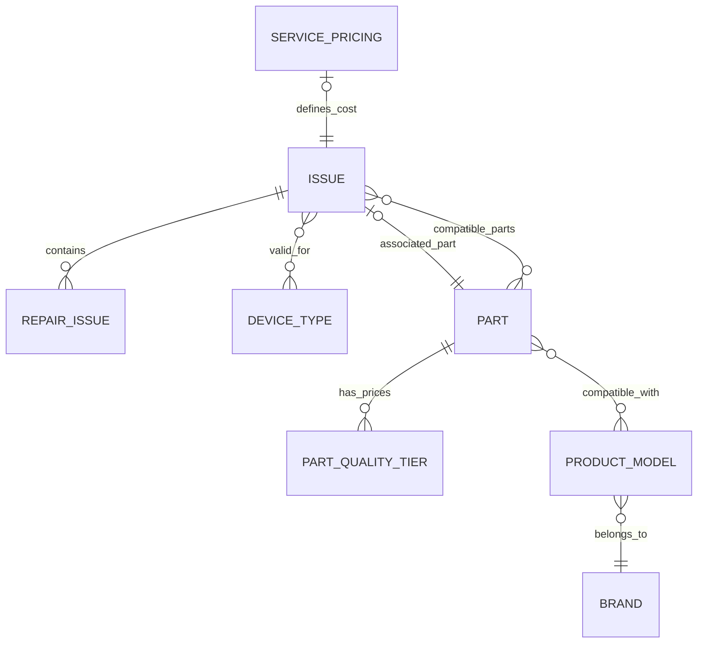

# Issue Pricing System: Technical Documentation

This document explains how the "Add Reparation" flow calculates prices and quality tier options dynamically based on the selected device model and issue type.

## 1. Data Model & Relationships

The system relies on a junction between Issues, Parts, and specific Product Models.

### Schema Overview



### Key Models

| Model | Purpose | Key Fields |
| :--- | :--- | :--- |
| **Issue** | The problem (e.g., "Screen Cracked") | `category_type` (part_based/service_based), `base_price` |
| **Part** | The physical hardware | `compatible_models` (M2M to ProductModel) |
| **PartQualityTier** | Pricing per quality | `quality_tier` (standard, premium, etc), `price`, `part_id` |
| **ServicePricing** | Labor-only costs | `issue_id`, `pricing_type` (fixed/hourly), `base_price` |

---

## 2. The Matching Logic

When a user selects an issue, the system must decide what pricing to show.

### Scenario A: Part-Based Issues
*Example: "Battery Not Charging"*

1.  **Input**: `Issue_ID` and `ProductModel_ID`.
2.  **Part Filtering**: The system looks for Parts that satisfy **two conditions**:
    *   The Part is linked to the **Issue** (either as the `associated_part` OR in `compatible_parts`).
    *   The Part is compatible with the **Product Model** (via the `compatible_models` relationship).
3.  **Tier Retrieval**: For the matching Parts, the system fetches all active `PartQualityTier` records (Standard, Premium, Original, etc.).
4.  **Availability**: Only tiers with `availability_status` in `['in_stock', 'low_stock']` are shown in the wizard.

### Scenario B: Service-Based Issues
*Example: "Software Update"*

1.  **Input**: `Issue_ID`.
2.  **Lookup**: The system checks the `ServicePricing` table for entries linked to that issue.
3.  **Fallback**: If no specific `ServicePricing` entry exists, it uses the `base_price` defined directly on the `Issue` model.

---

## 3. Data Flow (Frontend to Backend)

### 1. Fetching Options
When the quality modal opens, the `QualityTierSelector` triggers a request to:
`GET /api/repairs/part-quality-tiers/?model_id={modelId}&issue_id={issueId}`

**Backend Logic (`PartQualityTierViewSet`):**
```python
queryset.filter(
    Q(part__issues__id=issue_id) | Q(part__related_issues__id=issue_id),
    part__compatible_models__id=model_id,
    availability_status__in=["in_stock", "low_stock"]
)
```

### 2. Live Subtotal Calculation
The `useSubtotal` hook in the frontend watches the `selectedIssues` array in the store. It calculates the total in real-time:

*   **Part-based**: It finds the price of the `selectedTierId` for that specific issue.
*   **Service-based**: It uses the `basePrice` from the issue data.

### 3. State Persistence
The selected tier ID and custom notes are stored in `useReparationStore`. On final validation, these are mapped to the `repair_issue_data` payload for the `Repair` creation API.

---

## 4. Visual Schematic

```text
USER ACTION: Select "Screen Cracked" for "iPhone 12 Pro"
      |
      v
FRONTEND: Triggers query with Issue=1, Model=273
      |
      v
BACKEND: 
  1. Find Part where compatible_models contains 273 
     AND (associated_issue=1 OR compatible_issues contains 1)
  2. Found: "iPhone 12 Pro Screen Assembly" (ID: 45)
  3. Get Tiers for Part 45:
     - Standard: 80€
     - Premium: 120€
     - Original: 180€
      |
      v
FRONTEND: Displays 3 cards to user
      |
      v
USER ACTION: Selects "Premium"
      |
      v
STORE: updates selectedIssues[0].selectedTierId = 120
      |
      v
SIDEBAR: Subtotal updated to 120.00€
```
